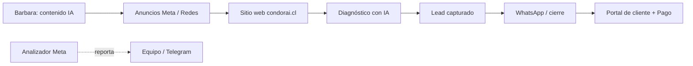
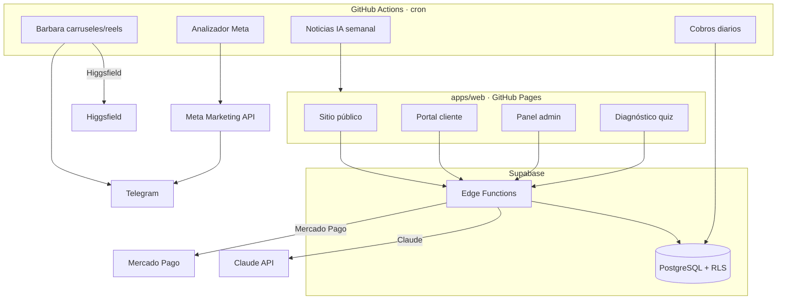

# 🏛️ Arquitectura — condor.ai

## Visión general (3 niveles)

### 🏔️ Nivel montaña — el negocio
condor.ai capta negocios por anuncios y contenido orgánico, los diagnostica con IA, los convierte en clientes y les cobra — todo automatizado donde se puede.

### 🌲 Nivel bosque — los componentes

### 🐜 Nivel hormiga — flujos clave

**Diagnóstico de un lead:**
1. Usuario completa el quiz en `apps/web/diagnostico-gratis/`.
2. El front llama a la Edge Function `diagnostico` (con anti-spam y validación).
3. La función llama a **Claude** (structured output) → genera diagnóstico + categoriza el lead.
4. Guarda el lead en la tabla `leads` (y opcionalmente lo sincroniza a Google Sheets).

**Cobro a un cliente:**
1. Admin crea el cliente en `admin.html` (tabla `clientes`).
2. Admin pulsa "Enviar cobro" → Edge Function `crear-pago` genera el link de Mercado Pago + manda email.
3. Cliente paga → `mp-webhook` confirma el pago, actualiza el estado y avisa.

**Contenido para redes (Barbara):**
1. GitHub Actions dispara `services/barbara` según el día (carrusel o reel).
2. Claude actúa de director (lee `content-log.json` para NO repetir) → genera prompts.
3. Higgsfield genera imágenes/video → se envía al grupo de Telegram para revisar.

---

## 🔐 Seguridad (resumen)

- **RLS (Row Level Security)** en todas las tablas: un cliente solo ve su ficha; los admins ven todo vía la función `es_admin()`.
- **Login sin contraseña filtrable:** `solicitar-acceso` solo envía código a correos registrados (anti-acceso de extraños) + rate limit por IP/correo.
- **Montos server-side:** `crear-pago` lee el monto de la base, el cliente no puede alterarlo.
- **Anti prompt-injection** y honeypot en el diagnóstico.
- **Secretos** nunca en el código → GitHub Secrets / Supabase Secrets.

Detalle de hallazgos y mitigaciones en el historial del equipo.

---

## 📦 Repos de producción (estado actual)

> ⚠️ Este monorepo es la **fuente de verdad para desarrollo**. La producción todavía corre en los repos originales mientras el equipo valida la migración (ver [`DEPLOY.md`](DEPLOY.md)):
> - Web (`condorai.cl`) → repo `condor-ai-web` (GitHub Pages)
> - Automatizaciones + Supabase → repo `condorweb-diagnostico`
>
> Los cron jobs de este monorepo están **desactivados** (solo manuales) para no duplicar publicaciones mientras coexisten.
